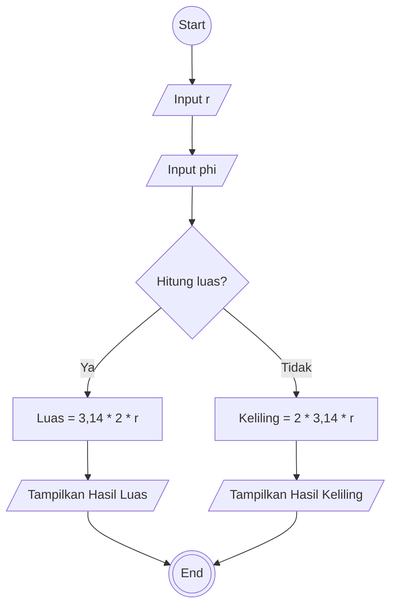

## Flowchart Luas dan Keliling Lingkaran

```mermaid
flowchart TD
  1((Start)) -->

  2[/Input r/] -->
  3[/Input phi/] -->

  4{Hitung luas?}
  4 --> |Ya| 5[Luas = 3,14 * 2 * r]
  4 --> |Tidak| 6[Keliling = 2 * 3,14 * r]

  5 --> 7[/Tampilkan Hasil Luas/]
  6 --> 8[/Tampilkan Hasil Keliling/]

  7 --> 9(((End)))
  8 --> 9(((End)))
```